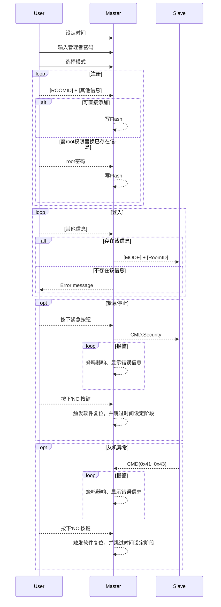

# SlaveMessage
## SequencDiagram::User-Master-Slave 

***
## Message::Frame
当Data Length为0时，不存在Data且Check也为0

```mermaid
gantt
dateFormat  SSS
title Message Frame

section Master
StartFrame(0xEF)  :done, 000, 001
CMD(1 Byte) :done, 001, 002
Data Length(1 Byte) : done, 002, 003
Data(Length Bytes) : done, 003, 004
Check(1 Byte) :done, 004, 005
```

## Message::CMD
name | value | description
---- | ----- | -----------
`ID_FINGER`| 0x10|`指纹模式`-发送ID
`ID_RFID`|0x11|`刷卡模式`-发送ID
`ID_KEY`|0x12|`按键模式`-发送ID
`UP_Start`|0x20|`操作模式`-按下`UP`
`DOWN_Start`|0x21|`操作模式`-按下`DOWN`
`RIGHT_Start`|0x22|`操作模式`-按下`RIGHT`
`LEFT_Start`|0x23|`操作模式`-按下`LEFT`
`UP_Stop`|0x30|`操作模式`-松开`UP`
`DOWN_Stop`|0x31|`操作模式`-松开`DOWN`
`RIGHT_Stop`|0x32|`操作模式`-松开`RIGHT`
`LEFT_Stop`|0x33|`操作模式`-松开`LEFT`
`SECURITY`|0x40|紧急制动
`ERROR_UNKNOW`|0x41|从机发送的`未知错误`
`ERROR_BREAKIN`|0x42|从机发送的`闯入警告`
`ERROR_LIMIT`|0x43|从机发送的`触发极限`
`ERROR_CHAT`|0x44|从机发送的`通讯错误`
