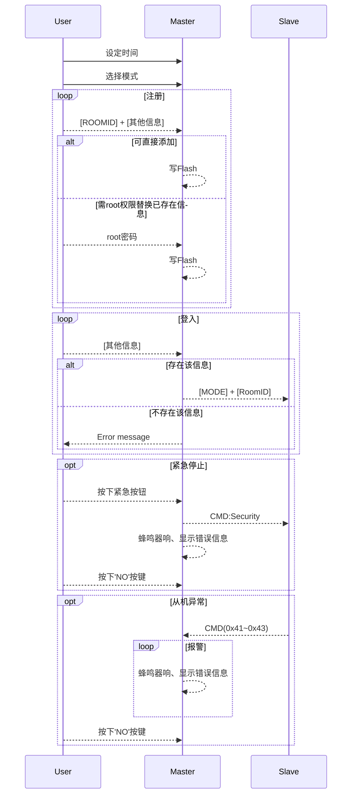

# SlaveMessage
## SequencDiagram::User-Master-Slave 

```mermaid
sequenceDiagram
  User->>Master: 设定时间
  User->>Master: 选择模式
  loop 注册
    User-->>Master: [ROOMID] + [其他信息]
    alt 可直接添加
      Master-->>Master: 写Flash
    else 需root权限替换已存在信息
      User-->>Master: root密码
      Master-->>Master: 写Flash
    end
  end 

  loop 登入
    User-->>Master: [其他信息]
    alt 存在该信息
      Master-->>Slave: [MODE] + [RoomID]
    else 不存在该信息
      Master-->>User: Error message
    end
  end

  opt 紧急停止
    User-->>Master: 按下紧急按钮
    Master-->>Slave: CMD:Security
    Master-->>Master: 蜂鸣器响、显示错误信息
    User-->>Master: 按下'NO'按键
  end

  opt 从机异常
    Slave-->>Master: CMD(0x41~0x43)
    loop 报警
    Master-->>Master: 蜂鸣器响、显示错误信息
    end
    User-->>Master: 按下'NO'按键
  end
```
***
## Message::Frame
当Data Length为0时，不存在Data且Check也为0

```mermaid
gantt
dateFormat  SSS
title Message Frame

section Master
StartFrame(0xEF)  :done, 000, 001
CMD(1 Byte) :done, 001, 002
Data Length(1 Byte) : done, 002, 003
Data(Length Bytes) : done, 003, 004
Check(1 Byte) :done, 004, 005
```